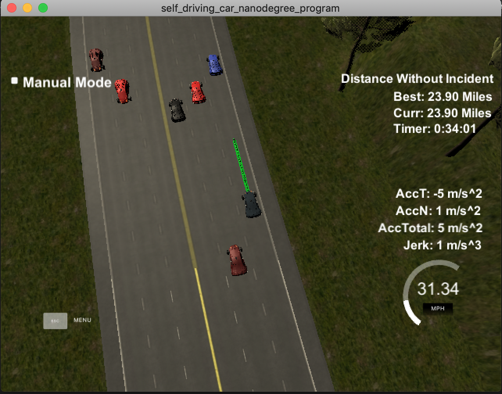

# Model Documentation

## Introduction

The goal of this projet is to implement a path planning model for a car can safely change lanes on a 3 lane highway.  The requirements for the model are

1. The car should stay under a speed of 50 mph.
2. The max acceleration and jerk should not exceed 10 m/s^2 and a jerk of 10 m/s^3.
3. The car should not collide with any other cars.
4. The car should stay within its lane except for changing lanes.  While changing lanes, it can only be outside its lane for no more than 3 seconds.

## Implementation

The model can be broken down into 3 steps:

1. Calculate other cars positions relative to our car (main.cpp, lines 286-337)
2. Based on the relative positions of the other cars, decide what the car should do (main.cpp, lines 348-415)
3. Create list of waypoints for the car to follow (main.cpp, lines 417-537)

### Calculate other cars positions relative to our car 

Before the model can decide what the car should do, it needs to know its lane position and the relative lane positions of the other nearby cars on the road.  The positions of the other cars comes from the sensor fusion data.  We only care about the position of cars within out lane clearning distance (LANE_CLEARANCE).  LANE_CLEARANCE is set to 30m.  Not only do we need to care about the other cars in the same lane as our car and to the immediate left and right of our car but we also have to know about the other cars in the outer lanes.  For the case when our car is in the center lane and it has the choice to switch into the left or right lanes, there is a look ahead for cars in the left and right lanes.  If one of the lanes ahead is clear, our car will prefer to switch into that lane.

### Based on the relative positions of the other cars, decide what the car should do 

The car has the following options of what it can do:

1. Go forward with a faster velocity (accelerate)
2. Go forward with a slower velocity (decelerate)
3. Go forward with the same velocity
4. Switch to the left lane
5. Switch to the right lane

#### Go forward at a faster speed (accelerate)

If there are no cars in front of our car (less than 30m in distance) and our car is not over our MAX_SPEED of 49.5 mph, keep moving forward but accelerate. The hard MAX_SPEED for our car is actually 50 mph but it is set slightly lower for our car to guarantee that we won't exceed the 50 mph.

#### Go forward at a slower speed (decelerate)

If there is a car immediately in front of ours (less than 30m in distance) and our car cannot switch lanes, slowly decelerate to try to not tailgate or collide into the car in front of us.  If our car sees a car abruptly switch lanes in front of us or our car is within 10m, decelerate by the MAX_ACC.  If the current speed is less than half the MAX_SPEED, only decelerate by half of the MAX_ACC.  The amount of deceleration is staggered lower at a lower speed in order to try to prevent a dangerous situation with our car coming to a complete stop on the highway.

#### Go forward at the same speed

If there are no cars in front of our car and we have already reached our MAX_SPEED, just keep going straight in the same lane at the same speed.

#### Switch to the left lane

If there is a car ahead of our car and the left lane is clear, try to switch to the left lane.  If we are on the far right lane, we also care if there is another car in the far left lane.  That car might also try to switch into our left lane.  If we both try to switch lanes at the same time, the cars will collide.  Our car also needs to have a velocity greater than MIN_LANE_CHANGING_SPEED which is 35.0 mph.  This is to ensure that our car is moving fast enough to safely execute the lane change without accelerating too much.  We also do not want to change lanes if the car in front of us is less than 10m away.  This gives us a safe distance so we can change lanes reducing the risk to colliding with the other car and triggering the max jerk and acceleration alerts.

#### Switch to the right lane

This is similar to "Switch to the left lane".

### Create list of waypoints for the car to follow 

Once we have decided what action our car should take, we need to create a list of waypoints for the car to follow based on the decided action.  This might be a straight line or a line that curves around the cars in front of us.  Based on some estimated points, we will use a spine to create a smooth line for the list of waypoints.  We want the line to smooth so our car doesn't need to make any sharp accelerations to execute a lane change creating sharp jerks.

## Reflections

For optimal performance of our car, it needs to try to stay in a clear lane traveling at the maximum speed.  If it is behind another car and cannot pass for a long time, it will accelerate and decelerate behind that car without reaching maximum speed.  Slowing down too much on the highway risks getting into dangerous situations with other cars rear ending our car.  Trying to maintain a safe distance away from a car that is in your lane and avoid tailgating also helps.  Changing lanes to try to get into a clear lane gets the car out of this suboptimal state but risks colliding into other cars.  

With the path planning model, our car was able to drive for over 30 miles without incident.  The incidents were usually caused by things that were beyond the control of our model.  The most common case is a car next to our car in another lane suddenly tries to change into our lane. There were also instances of cars from the other side of the highway cross over into our car's lane.  There is not a lot that our model can do to avoid that.  

